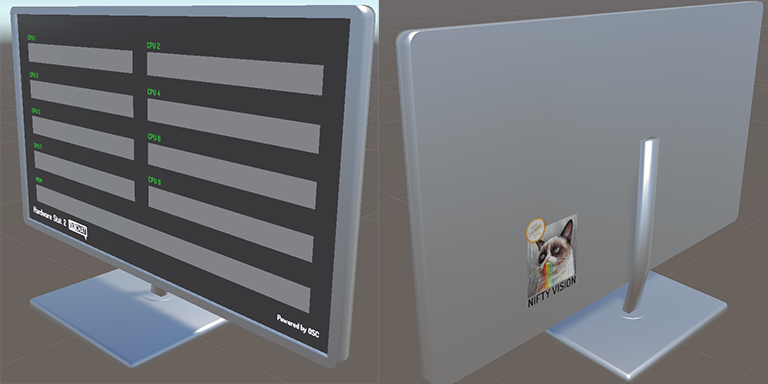
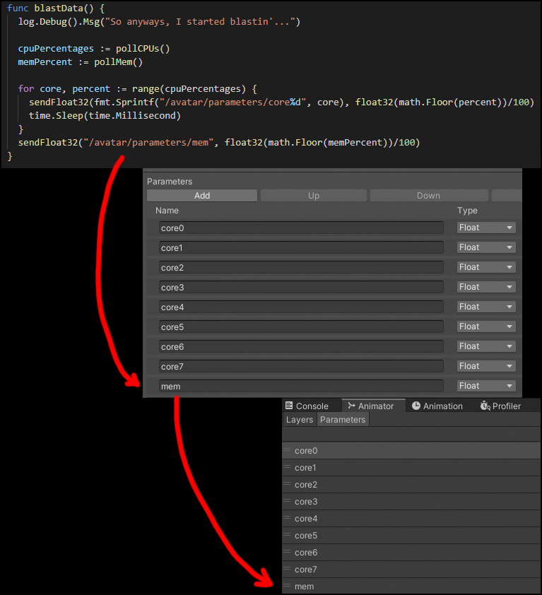

# Hardware Stat 2 VRChat
## Example Custom OSC Driver

**Remember to enable OSC in your Action Menu!** `Action Menu -> Config -> OSC`

This project serves as an example of how to code your own OSC driver for VRChat. This example driver sends your per-core CPU and RAM usage to avatar parameters.

The driver has been written in 2 languages: Golang and Node.js. The Golang version has an .exe prebuilt in the Releases section. The Node.js version can't be built into an .exe and therefore requires you to install Node.js to run. Both versions have their own dedicated README on how to run/build them or customize their parameters.

The below sample avatar has been included. The source files can be found in the `Sample Avatar` folder, but a precompiled .unitypackage can be found in the Releases section.

## How it works

The OSC driver broadcasts floats (0-1) to the avatar parameters by using the paths `/avatar/parameters/coreN` for the CPU where `N` is the core number starting with 0, and `/avatar/parameters/mem` for the RAM usage. The avatar is set up with those same VRChat Avatar Parameters and Unity Animator Controller Parameters, as shown below.

## Want a Unity Version? Nifty Needs Help!

I'm not well versed in C#, so the Unity version isn't quite done. If you'd like to help finish it, check the `unity-port` branch and submit a Pull Request! Check the README in that branch's Unity folder to see what I have and haven't done.